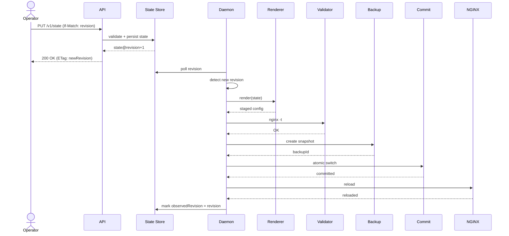

# Apply Sequence Diagram

```mermaid
sequenceDiagram
  actor Operator
  participant API
  participant SS as State Store
  participant D as Daemon
  participant R as Renderer
  participant V as Validator
  participant B as Backup
  participant C as Commit
  participant N as NGINX

  Operator->>API: PUT /v1/state (If-Match: revision)
  API->>SS: validate + persist state
  SS-->>API: state@revision+1
  API-->>Operator: 200 OK (ETag: newRevision)

  D->>SS: poll revision
  D->>D: detect new revision

  D->>R: render(state)
  R-->>D: staged config
  D->>V: nginx -t
  V-->>D: OK
  D->>B: create snapshot
  B-->>D: backupId
  D->>C: atomic switch
  C-->>D: committed
  D->>N: reload
  N-->>D: reloaded

  D->>SS: mark observedRevision = revision
```
