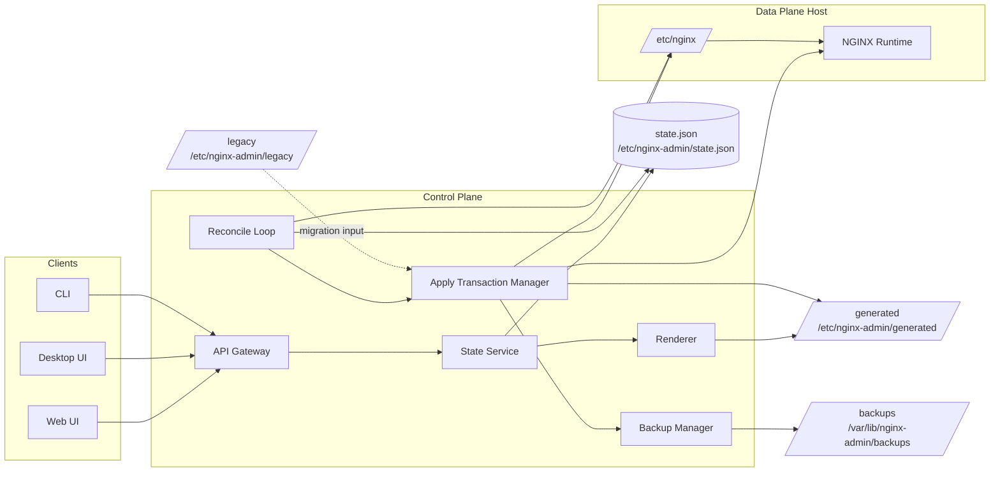

# Architecture Diagram

```mermaid
flowchart LR
  subgraph Clients
    WEB[Web UI]
    DESKTOP[Desktop UI]
    CLI[CLI]
  end

  subgraph ControlPlane[Control Plane]
    API[API Gateway]
    STATE[State Service]
    RENDERER[Renderer]
    APPLY[Apply Transaction Manager]
    BACKUP[Backup Manager]
    RECONCILE[Reconcile Loop]
  end

  STATE_FILE[(state.json<br/>/etc/nginx-admin/state.json)]
  GENERATED[/generated<br/>/etc/nginx-admin/generated/]
  LEGACY[/legacy<br/>/etc/nginx-admin/legacy/]
  BACKUPS[/backups<br/>/var/lib/nginx-admin/backups/]

  subgraph DataPlaneHost[Data Plane Host]
    NGINX[NGINX Runtime]
    ETC_NGINX[/etc/nginx/]
  end

  WEB --> API
  DESKTOP --> API
  CLI --> API

  API --> STATE
  STATE --> STATE_FILE
  STATE --> RENDERER
  RENDERER --> GENERATED

  APPLY --> GENERATED
  APPLY --> BACKUP
  BACKUP --> BACKUPS
  APPLY --> ETC_NGINX
  APPLY --> NGINX

  RECONCILE --> STATE_FILE
  RECONCILE --> ETC_NGINX
  RECONCILE --> APPLY

  LEGACY -. migration input .-> APPLY
  ETC_NGINX --> NGINX
```
