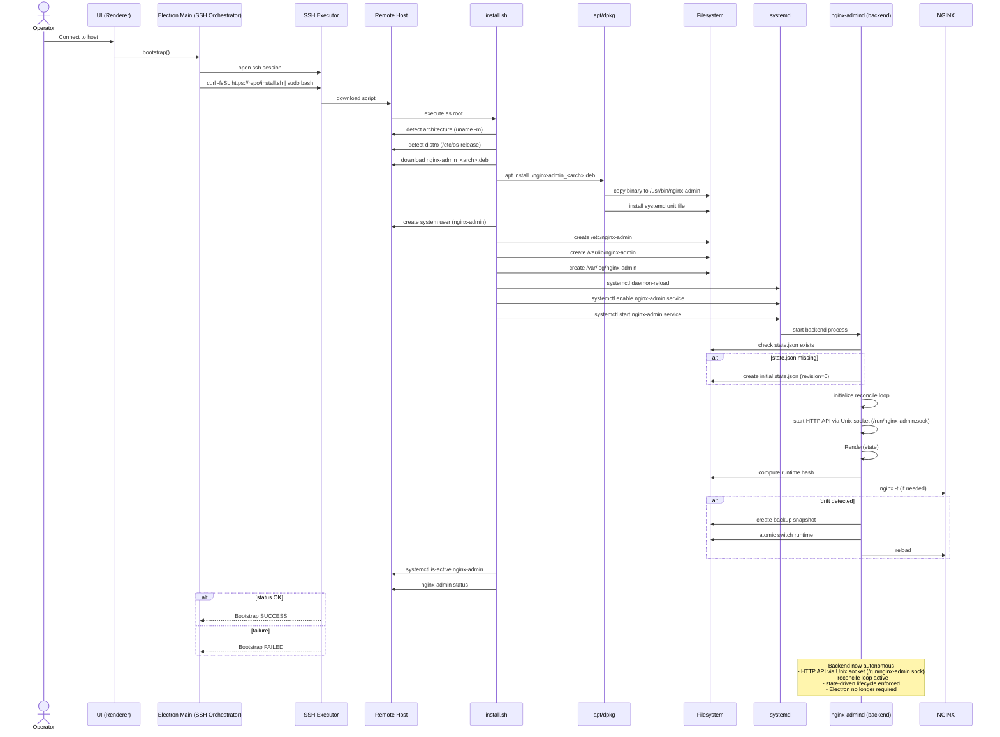

# Init Daemon Sequence Diagram

```mermaid
sequenceDiagram
  actor Operator
  participant UI as UI (Renderer)
  participant MAIN as Electron Main (SSH Orchestrator)
  participant SSH as SSH Executor
  participant HOST as Remote Host
  participant SCRIPT as install.sh
  participant PKG as apt/dpkg
  participant FS as Filesystem
  participant SD as systemd
  participant DAEMON as nginx-admind (backend)
  participant NGINX as NGINX

  %% 1. Operator triggers bootstrap
  Operator->>UI: Connect to host
  UI->>MAIN: bootstrap()
  MAIN->>SSH: open ssh session

  %% 2. Execute remote installer
  MAIN->>SSH: curl -fsSL https://repo/install.sh | sudo bash
  SSH->>HOST: download script
  HOST->>SCRIPT: execute as root

  %% 3. install.sh logic
  SCRIPT->>HOST: detect architecture (uname -m)
  SCRIPT->>HOST: detect distro (/etc/os-release)
  SCRIPT->>HOST: download nginx-admin_<arch>.deb
  SCRIPT->>PKG: apt install ./nginx-admin_<arch>.deb

  PKG->>FS: copy binary to /usr/bin/nginx-admin
  PKG->>FS: install systemd unit file
  SCRIPT->>HOST: create system user (nginx-admin)
  SCRIPT->>FS: create /etc/nginx-admin
  SCRIPT->>FS: create /var/lib/nginx-admin
  SCRIPT->>FS: create /var/log/nginx-admin
  SCRIPT->>SD: systemctl daemon-reload
  SCRIPT->>SD: systemctl enable nginx-admin.service
  SCRIPT->>SD: systemctl start nginx-admin.service
  SD->>DAEMON: start backend process

  %% 4. Backend initialization
  DAEMON->>FS: check state.json exists
  alt state.json missing
    DAEMON->>FS: create initial state.json (revision=0)
  end
  DAEMON->>DAEMON: initialize reconcile loop
  DAEMON->>DAEMON: start HTTP API via Unix socket (/run/nginx-admin.sock)

  %% 5. Initial reconcile
  DAEMON->>DAEMON: Render(state)
  DAEMON->>FS: compute runtime hash
  DAEMON->>NGINX: nginx -t (if needed)
  alt drift detected
    DAEMON->>FS: create backup snapshot
    DAEMON->>FS: atomic switch runtime
    DAEMON->>NGINX: reload
  end

  %% 6. Health verification
  SCRIPT->>HOST: systemctl is-active nginx-admin
  SCRIPT->>HOST: nginx-admin status

  alt status OK
    SSH-->>MAIN: Bootstrap SUCCESS
  else failure
    SSH-->>MAIN: Bootstrap FAILED
  end

  Note over DAEMON: Backend now autonomous<br/>- HTTP API via Unix socket (/run/nginx-admin.sock)<br/>- reconcile loop active<br/>- state-driven lifecycle enforced<br/>- Electron no longer required
```
