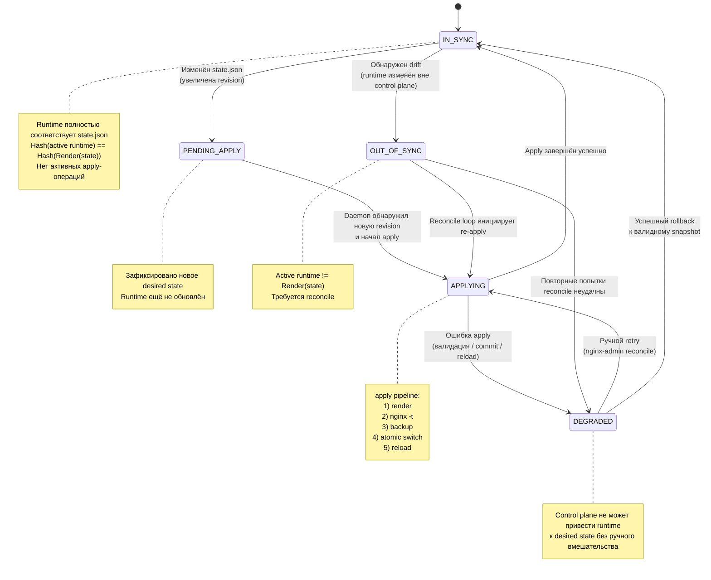

# State Flow Diagram

```mermaid
stateDiagram-v2
  [*] --> IN_SYNC

  note right of IN_SYNC
    Runtime полностью соответствует state.json
    Hash(active runtime) == Hash(Render(state))
    Нет активных apply-операций
  end note

  IN_SYNC --> PENDING_APPLY: Изменён state.json<br/>(увеличена revision)
  note right of PENDING_APPLY
    Зафиксировано новое desired state
    Runtime ещё не обновлён
  end note

  PENDING_APPLY --> APPLYING: Daemon обнаружил новую revision<br/>и начал apply
  note right of APPLYING
    apply pipeline:
    1) render
    2) nginx -t
    3) backup
    4) atomic switch
    5) reload
  end note

  APPLYING --> IN_SYNC: Apply завершён успешно
  APPLYING --> DEGRADED: Ошибка apply<br/>(валидация / commit / reload)

  IN_SYNC --> OUT_OF_SYNC: Обнаружен drift<br/>(runtime изменён вне control plane)
  note right of OUT_OF_SYNC
    Active runtime != Render(state)
    Требуется reconcile
  end note

  OUT_OF_SYNC --> APPLYING: Reconcile loop инициирует re-apply
  OUT_OF_SYNC --> DEGRADED: Повторные попытки reconcile неудачны

  note right of DEGRADED
    Control plane не может привести runtime
    к desired state без ручного вмешательства
  end note
  DEGRADED --> APPLYING: Ручной retry<br/>(nginx-admin reconcile)
  DEGRADED --> IN_SYNC: Успешный rollback<br/>к валидному snapshot
```
